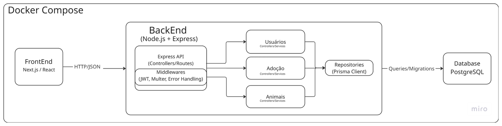

# Arquitetura do projeto
## Aplicação monolítica:
A arquitetura adotada pelo projeto se baseia no modelo monolítico, pois todas as funcionalidades presentes na aplicação são desenvolvidas e implementadas como uma única unidade, o código da interface do usuário (frontend), a lógica de negócios e o acesso a dados (backend) estão todos em uma mesma base de código. 

Em outras palavras o código para gerenciar animais, usuários, a lógica para renderizar as páginas HTML e as configurações do servidor estão todos contidos no mesmo projeto. Não existem programas ou serviços externos dos quais ele dependa para funcionar. Quando a aplicação está no ar, existe um único processo principal, devido a organização por containers com docker respondendo por tudo.

O sistema também adota o padrão MVC adaptado ao monolito, combinando um sistema em camadas conectando os módulos de frontend e backend.

## Estrutura do Sistema:

  - Backend:
    - Node.js + Express.js;
    - ORM Prisma;
    - Banco de dados persistente em PostgreSQL;

  - Frontend:
    - Nest.js;
    - Manipulação dos dados (Model): frontend/src/@types;
    - Processamento e visualização de dados (View): frontend/src/app;
    - Apresentação e interação (Controller): frontend/src/layout.tsx, ../../layout.tsx, ../../area_logada, ../../cadastro, ../../login;

# Diagrama de componentes:

