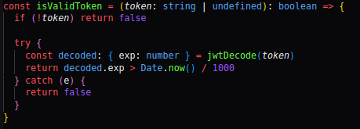
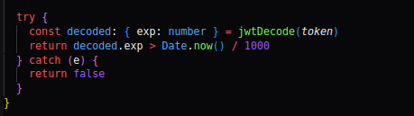
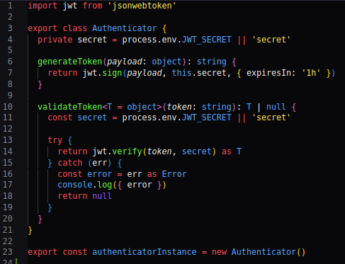
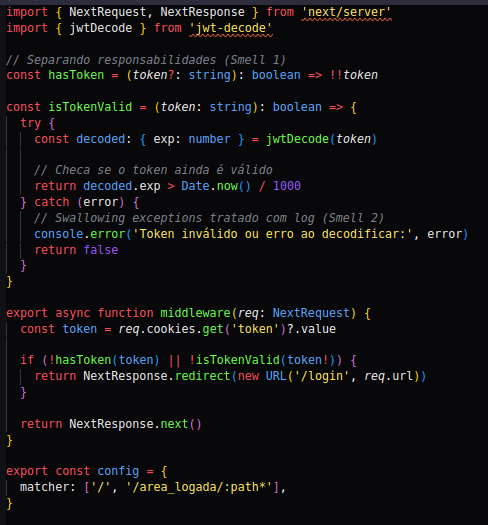
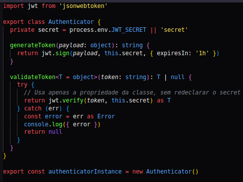

# Smells detectados:
## 1-Mixed Responsability
A função `isValidToken` (encontrada em frontend/src/middleware.ts), viola o princípio da responsabilidade única porque realiza duas operações distintas:
    1-Verifica a existência de um token, `if (!token) return false`;
    2-Verifica se o token é válido através do uso `jwtDecode`;

## 2-Swallowing Exceptions
Ainda dentro da função anterior `sValidToken`, há outro smell baseado na captura de erros onde não ocorre um tratamento específico para qualquer que seja o erro capturado; especificamente nesse trecho de código, qualquer erro que aconteça dentro do try — seja o token inválido, `jwtDecode` quebrado ou até um bug inesperado — será silenciosamente ignorado e a função apenas retorna false.

## 3-Redudant Field
Na classe `Authenticator` (em backend/src/providers/authenticator.ts), existe uma duplicação do secret do JWT, que viola o princípio DRY (Don't Repeat Yourself). O secret é declarado duas vezes: como propriedade da classe (this.secret) e novamente dentro do método `validateToken`. A duplicação aumenta a chance de inconsistência caso a forma de obter o segredo seja alterada no futuro. Reduz a clareza e dificulta a manutenção do código.

# Refatoração
## Refatoração dos smells 1 e 2:

Na refatoração o código foi dividido para separar responsabilidades: a verificação da existência do token (`hasToken`) foi separada da validação do token (`isTokenValid`), atendendo ao princípio Single Responsibility. Além disso, o tratamento de erros na decodificação do token passou a registrar mensagens no console (`console.error`) em vez de apenas retornar false, evitando o problema de Swallowing Exceptions.

## Refatoração do smell 3:

Na refatoração do smell 3, há a remoção da duplicação do secret do JWT. Agora, todos os métodos usam apenas a propriedade da classe (`this.secret`), garantindo uma única fonte de verdade, aumentando a consistência, facilitando a manutenção e atendendo ao princípio DRY (Don't Repeat Yourself), sem alterar a funcionalidade original da classe.
